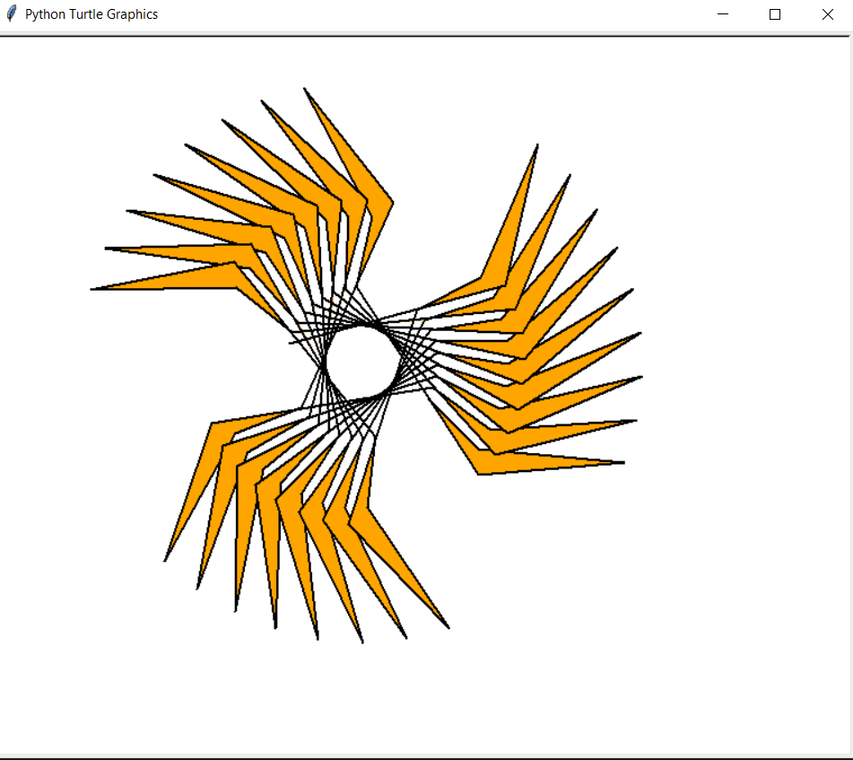

# Flaming Ninja Star

Let's make a FLAMING NINJA STAR!

# Assignment

Read the comments carefully in the code below for instructions.

<iframe width="100%" height="800" src="https://trinket.io/tools/1.0/jekyll/embed/python#code=import%20random%0Aimport%20turtle%0A%0A%0A%23%20Returns%20a%20random%20color%21%0Adef%20getRandomColor%28%29%3A%0A%20%20%20%20return%20%22%23%2506X%22%20%25%20%28random.randint%280%2C%200xFFFFFF%29%29%0A%0A%0Acolors%20%3D%20%5B%22red%22%2C%20%22blue%22%2C%20%22green%22%2C%20%22yellow%22%2C%20%22orange%22%5D%0A%0A%0Adef%20getNextColor%28i%29%3A%0A%20%20%20%20return%20colors%5Bi%20%25%20len%28colors%29%5D%0A%0A%0A%23%20%3D%3D%3D%3D%3D%3D%3D%3D%3D%3D%3D%3D%3D%3D%3D%3D%3D%3D%3D%3D%3D%3D%20DO%20NOT%20EDIT%20THE%20CODE%20ABOVE%20%3D%3D%3D%3D%3D%3D%3D%3D%3D%3D%3D%3D%3D%3D%3D%3D%3D%3D%3D%3D%3D%3D%3D%3D%3D%3D%3D%0A%0Awindow%20%3D%20turtle.Screen%28%29%0A%0AbaseSize%20%3D%20200%20%20%23%20the%20size%20of%20the%20black%20part%20of%20the%20star%0AflameSize%20%3D%20130%20%20%23%20the%20length%20of%20the%20flaming%20arms%0A%0A%23%20Make%20a%20new%20turtle%0AmyTurtle%20%3D%20turtle.Turtle%28%29%20%20%23%20%3B%0A%0A%23%20Make%20the%20turtle%20shape%20%27turtle%27%2C%20.shape%28%27turtle%27%29%0AmyTurtle.shape%28%22turtle%22%29%20%20%23%20%3B%0A%0A%23%20Set%20the%20turtle%20width%20to%202%0AmyTurtle.width%282%29%20%20%23%20%3B%0A%0A%23%20Set%20the%20turtle%20speed%20to%20max%20%280%29%0AmyTurtle.speed%280%29%20%20%23%20%3B%0A%0A%23%20Use%20a%20for%20loop%20to%20repeat%20all%20of%20the%20code%20below%20ONE%20time%20%28we%20will%20change%20this%20later%29%0Afor%20i%20in%20range%2825%29%3A%0A%20%20%20%20%23%20After%20the%20code%20is%20working%20to%20make%20the%20flame%20pattern%20you%20can%20change%20the%20pen%20color%20to%20a%20random%20color%3A%20%20Enter%20the%20code%20to%20change%20the%20pen%20color%20to%20a%20random%20color%20here%2C%20hint%3A%20you%20can%20use%20the%20getRandomColor%28%29%20function%20or%20the%20getNextColor%28%29%20function%0A%20%20%20%20myTurtle.pencolor%28getRandomColor%28%29%29%0A%0A%20%20%20%20%23%20After%20the%20code%20is%20working%20to%20make%20the%20flame%20pattern%20you%20can%20change%20the%20fill%20color%20to%20a%20random%20color%3A%20%20Enter%20the%20code%20to%20change%20the%20fill%20color%20to%20a%20random%20color%20here%2C%20hint%3A%20you%20can%20use%20the%20getRandomColor%28%29%20function%20or%20the%20getNextColor%28%29%20function%0A%20%20%20%20myTurtle.fillcolor%28getRandomColor%28%29%29%20%20%23%20%3B%0A%20%20%20%20%23%20myTurtle.fillcolor%28%22orange%22%29%0A%20%20%20%20myTurtle.begin_fill%28%29%0A%0A%20%20%20%20%23%20TURN%20RIGHT%20%20%20%20%20Turn%20the%20turtle%201/8%20of%20a%20circle%20%28hint%3A%20360%20degrees%20will%20turn%20a%20full%20circle%29%0A%20%20%20%20myTurtle.right%28360%20/%208%29%20%20%23%20%3B%0A%20%20%20%20%23%20DRAW%20%20%20%20%20%20%20%20%20%20%20Move%20the%20turtle%2064%20pixels%0A%20%20%20%20myTurtle.forward%2864%29%20%20%23%20%3B%0A%0A%20%20%20%20%23%20TURN%20LEFT%20%20%20%20%20%20Turn%20the%20turtle%2040%20degrees%20to%20the%20LEFT.%20%28Negative%20numbers%20will%20turn%20the%20turtle%20counter-clockwise.%29%0A%20%20%20%20myTurtle.left%2840%29%20%20%23%20%3B%0A%0A%20%20%20%20%23%20DRAW%20FLAME%20%20%20%20%20Move%20the%20turtle%20the%20distance%20in%20the%20variable%20flameSize%0A%20%20%20%20myTurtle.forward%28flameSize%29%20%20%23%20%3B%0A%0A%20%20%20%20%23%20%20%20%20%20%20%20%20%20%20%20%20%20%20%20%20Turn%20the%20turtle%20to%20the%20right%20170%20degrees%0A%20%20%20%20myTurtle.right%28170%29%20%20%23%20%3B%0A%0A%20%20%20%20%23%20%20%20%20%20%20%20%20%20%20%20%20%20%20%20%20Move%20the%20turtle%20the%20distance%20in%20the%20variable%20flameSize%20%28again%29%0A%20%20%20%20myTurtle.forward%28flameSize%29%20%20%23%20%3B%0A%0A%20%20%20%20%23%20%20TURN%20RIGHT%20%20%20%20Turn%20the%20turtle%2062%20degrees%20to%20the%20right%0A%20%20%20%20myTurtle.right%2862%29%20%20%23%20%3B%0A%0A%20%20%20%20%23%20%20DRAW%20%20%20%20%20%20%20%20%20%20Move%20the%20turtle%20the%20distance%20in%20the%20variable%20baseSize%0A%20%20%20%20myTurtle.forward%28baseSize%29%20%20%23%20%3B%0A%0A%20%20%20%20myTurtle.end_fill%28%29%0A%0A%23%20Hide%20your%20turtle%20so%20you%20can%20see%20the%20pattern.%0AmyTurtle.hideturtle%28%29%20%20%23%20%3B%0A%0A%23%20TEST%20%20%20Run%20the%20program.%20Check%20that%20your%20shape%20is%20the%20same%20as%20the%20first%20picture%20in%20the%20recipe.%0A%23%20%20%20%20%20%20%20%20This%20is%20one%20arm%20of%20the%20ninja%20star.%0A%0A%23%20COLOR%20%20Change%20the%20turtle%27s%20pen%20color%20so%20that%20the%20flame%20is%20a%20different%20color%20to%20the%20rest%20of%20the%20star.%20%20Add%20code%20to%20change%20the%20color%20of%20the%20turtle%27s%20pen%20to%20a%20random%20color.%0A%23%20%20%20%20%20%20%20%20You%20can%20use%20code%20like%20this%3A%20myTurtle.pencolor%28getRandomColor%28%29%29%20%20%2A%2A%20This%20will%20need%20to%20be%20added%20in%20the%20beginning%20of%20the%20for%20loop.%0A%0A%23%20Run%20the%20program%20again.%20Check%20the%20second%20picture%20in%20the%20recipe.%0A%0A%23%20LOOP%20%20%20When%20you%20have%20one%20arm%20looking%20right%2C%20change%20your%20for%20loop%20to%20repeat%2025%20times.%0A%0A%23%20call%20the%20turtle%20.done%28%29%20method%0Aturtle.done%28%29%20%20%23%20%3B" frameborder="0" marginwidth="0" marginheight="0" allowfullscreen></iframe>

