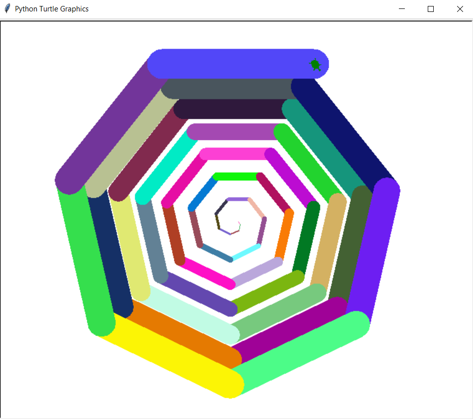

# Turtle Spiral

Let's make the turtle dizzy by drawing a spiral!

# Assignment

Read the comments carefully in the code below for instructions.

<iframe width="100%" height="400" src="https://trinket.io/tools/1.0/jekyll/embed/python#code=import%20random%0Aimport%20turtle%0A%0A%0A%23%20Returns%20a%20random%20color%21%0Adef%20getRandomColor%28%29%3A%0A%20%20%20%20return%20%22%23%2506X%22%20%25%20%28random.randint%280%2C%200xFFFFFF%29%29%0A%0A%0A%23%20%3D%3D%3D%3D%3D%3D%3D%3D%3D%3D%3D%3D%3D%3D%3D%3D%3D%3D%3D%3D%3D%3D%20DO%20NOT%20EDIT%20THE%20CODE%20ABOVE%20%3D%3D%3D%3D%3D%3D%3D%3D%3D%3D%3D%3D%3D%3D%3D%3D%3D%3D%3D%3D%3D%3D%3D%3D%3D%3D%3D%0A%0Awindow%20%3D%20turtle.Screen%28%29%20%20%23%20%3B%0Awindow.bgcolor%28%22white%22%29%20%20%23%20%3B%0A%0A%23%20Make%20a%20new%20turtle%0AmyTurtle%20%3D%20turtle.Turtle%28%29%20%20%23%20%3B%0A%0A%23%20This%20code%20sets%20our%20shape%20to%20a%20turtle%0AmyTurtle.shape%28%22turtle%22%29%20%20%23%20%3B%0A%0A%23%20Set%20your%20turtle%27s%20speed%0AmyTurtle.speed%280%29%20%20%23%20%3B%0A%0A%23%20Set%20your%20turtle%27s%20color%0AmyTurtle.color%28%22green%22%29%20%20%23%20%3B%0A%0A%23%20Use%20a%20loop%20to%20repeat%20the%20code%20below%2050%20times%0Afor%20i%20in%20range%2850%29%3A%20%20%23%20%3B%0A%0A%20%20%20%20%23%20Set%20the%20turtle%20color%20to%20a%20random%20color%0A%20%20%20%20myTurtle.pencolor%28getRandomColor%28%29%29%20%20%23%20%3B%0A%0A%20%20%20%20%23%20Move%20the%20turtle%20%285%2Ai%29%20pixels.%20%27i%27%20is%20the%20loop%20variable%0A%20%20%20%20myTurtle.forward%285%20%2A%20i%29%20%20%23%20%3B%0A%0A%20%20%20%20%23%20Turn%20the%20turtle%20%28360/7%29%20degrees%20to%20the%20right%0A%20%20%20%20myTurtle.right%28360%20/%207%29%20%20%23%20%3B%0A%0A%20%20%20%20%23%20Change%20the%20turtle%20width%20to%20%27i%27%20%28the%20loop%20variable%29%0A%20%20%20%20myTurtle.width%28i%29%20%20%23%20%3B%0A%0A%20%20%20%20%23%20Check%20the%20pattern%20against%20the%20picture%20in%20the%20recipe.%20If%20it%20matches%2C%20you%20are%20done%21%0A%0A%23%20%3D%3D%3D%3D%3D%3D%3D%3D%3D%3D%3D%3D%3D%3D%3D%3D%3D%3D%3D%3D%3D%20DO%20NOT%20EDIT%20THE%20CODE%20BELOW%20%3D%3D%3D%3D%3D%3D%3D%3D%3D%3D%3D%3D%3D%3D%3D%3D%3D%3D%3D%3D%3D%3D%3D%3D%3D%3D%3D%3D%0Aturtle.done%28%29" frameborder="0" marginwidth="0" marginheight="0" allowfullscreen></iframe>

