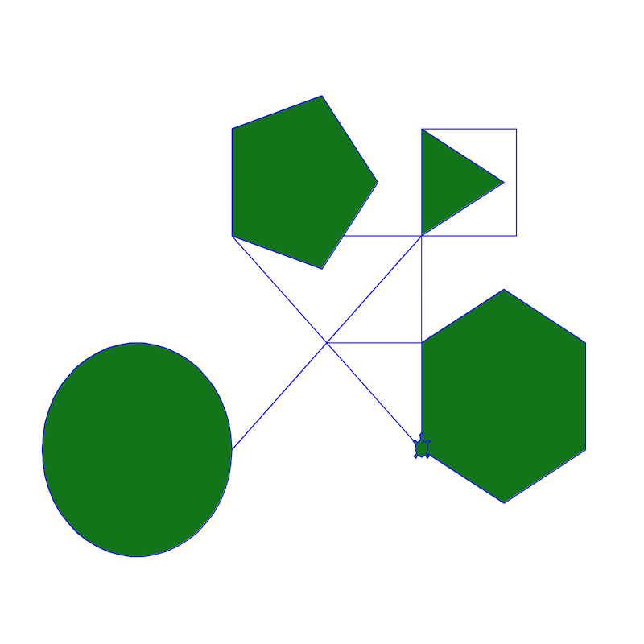

# Shapes and Colors

In this lesson, we will teach the turtle to draw shapes and colors. Here is 
what your turtle will be able to do by the end of this lesson:

# Assignment

Read each of  the comments in the code carefully for instructions. 

<iframe width="100%" height="600" src="https://trinket.io/tools/1.0/jekyll/embed/python#code=import%20turtle%20as%20turtle%0A%0A%0Awindow%20%3D%20turtle.Screen%28%29%0Awindow.bgcolor%28%27white%27%29%0A%0A%23%20This%20code%20makes%20a%20new%20Turtle.%20Pick%20a%20new%20name%20for%20the%20turtle%0AmyTurtle%20%3D%20turtle.Turtle%28%29%0A%0A%23%20Make%20your%20turtle%27s%20shape%20%27turtle%27%2C%20.shape%28%27turtle%27%29%0AmyTurtle.shape%28%27turtle%27%29%20%20%23%20%3B%0A%0A%23%20Set%20your%20turtle%27s%20speed%20using%20.speed%282%29%0AmyTurtle.speed%280%29%20%20%23%20%3B%0A%0A%23%20Set%20your%20turtle%27s%20color%20using%20.color%28%27green%27%29%20and%20.pencolor%28%27blue%27%29%0AmyTurtle.color%28%27green%27%29%20%20%23%20%3B%0AmyTurtle.pencolor%28%27blue%27%29%20%20%23%20%3B%0A%0A%23%20Move%20your%20turtle%20forward%20using%20.forward%28100%29%0AmyTurtle.forward%28100%29%20%20%23%20%3B%0A%0A%23%20Move%20your%20turtle%20left%20or%20right%20using%20.left%2890%29%20or%20.right%2890%29%0AmyTurtle.left%2890%29%20%20%23%20%3B%0AmyTurtle.forward%28100%29%20%20%23%20%3B%0A%0A%23%20Now%20put%20the%20forward%20and%20left/right%20code%20into%20a%20for%20loop%20to%20repeat%204%20times.%0A%23%20Did%20your%20Robot%20draw%20a%20square%3F%0Afor%20i%20in%20range%284%29%3A%20%20%23%20%3B%0A%20%20%20%20myTurtle.forward%28100%29%20%20%23%20%3B%0A%20%20%20%20myTurtle.right%2890%29%20%20%23%20%3B%0A%0A%23%20Move%20your%20turtle%20to%20a%20new%20place%20on%20the%20screen%20using%20.goto%28x%2C%20y%29%0A%23%20x%3D0%20and%20y%3D0%20is%20the%20center%20of%20the%20screen%0AmyTurtle.goto%28-100%2C-100%29%20%20%23%20%3B%0A%0A%23%20Have%20your%20turtle%20draw%20a%20circle%20using%20.circle%28radius%2C%20steps%3D50%29%0AmyTurtle.begin_fill%28%29%20%20%23%20%3B%0AmyTurtle.circle%28100%2C%20steps%3D50%29%20%20%23%20%3B%0AmyTurtle.end_fill%28%29%20%20%23%20%3B%0A%0A%23%20Add%20color%20to%20your%20shape%20by%20adding%20.begin_fill%28%29%20before%20drawing%20the%20shape%0A%23%20and%20.end_fill%28%29%20after%0A%0A%23%20Draw%203%20more%20shapes%20with%20different%20fill%20colors%21%0A%23%20Draw%20a%20triangle%20%20%23%20%3B%0AmyTurtle.goto%28100%2C100%29%20%20%23%20%3B%0AmyTurtle.begin_fill%28%29%20%20%23%20%3B%0Afor%20i%20in%20range%283%29%3A%20%20%23%20%3B%0A%20%20%20%20myTurtle.forward%28100%29%20%20%23%20%3B%0A%20%20%20%20myTurtle.right%28120%29%20%20%23%20%3B%0AmyTurtle.end_fill%28%29%20%20%23%20%3B%0A%0A%23%20Draw%20a%20pentagon%20%20%23%20%3B%0AmyTurtle.goto%28-100%2C100%29%20%20%23%20%3B%0AmyTurtle.begin_fill%28%29%20%20%23%20%3B%0Afor%20i%20in%20range%285%29%3A%20%20%23%20%3B%0A%20%20%20%20myTurtle.forward%28100%29%20%20%23%20%3B%0A%20%20%20%20myTurtle.right%2872%29%20%20%23%20%3B%0AmyTurtle.end_fill%28%29%20%20%23%20%3B%0A%0A%23%20Draw%20a%20hexagon%20%20%23%20%3B%0AmyTurtle.goto%28100%2C-100%29%20%20%23%20%3B%0AmyTurtle.begin_fill%28%29%20%20%23%20%3B%0Afor%20i%20in%20range%286%29%3A%20%20%23%20%3B%0A%20%20%20%20myTurtle.forward%28100%29%20%20%23%20%3B%0A%20%20%20%20myTurtle.right%2860%29%20%20%23%20%3B%0AmyTurtle.end_fill%28%29%20%20%23%20%3B%0A%0A%0A%23%20%3D%3D%3D%3D%3D%3D%3D%3D%3D%3D%3D%3D%3D%3D%3D%3D%3D%3D%3D%3D%3D%20DO%20NOT%20EDIT%20THE%20CODE%20BELOW%20%3D%3D%3D%3D%3D%3D%3D%3D%3D%3D%3D%3D%3D%3D%3D%3D%3D%3D%3D%3D%3D%3D%3D%3D%3D%3D%3D%3D%0Aturtle.done%28%29" frameborder="0" marginwidth="0" marginheight="0" allowfullscreen></iframe>

Have fun!
